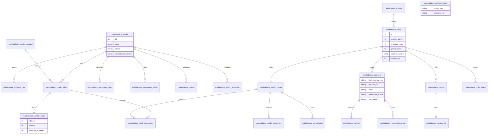

# Database ER diagram

`PREFIX_` is omitted. The storefront cart and collection tables are unchanged and are not part of the payment flow, so they are left off this diagram.

```mermaid
erDiagram
    marketplace_vendor ||--o{ marketplace_shipping_rule : quotes
    marketplace_vendor ||--o{ marketplace_vendor_offer : sells
    marketplace_vendor ||--o| marketplace_mangopay_user : identifies
    marketplace_vendor ||--o{ marketplace_mangopay_wallet : holds
    marketplace_vendor ||--o{ marketplace_payout : withdraws
    marketplace_vendor ||--o{ marketplace_import_schedule : schedules
    marketplace_vendor_offer ||--|| marketplace_vendor_stock : stocks
    marketplace_vendor_offer ||--o{ marketplace_stock_reservation : reserves
    marketplace_master_product ||--o{ marketplace_vendor_offer : matches
    marketplace_shopper ||--o{ marketplace_order : places
    marketplace_order ||--|{ marketplace_vendor_order : splits
    marketplace_vendor_order ||--|{ marketplace_vendor_order_line : contains
    marketplace_vendor_order ||--o{ marketplace_stock_reservation : holds
    marketplace_vendor_order ||--o{ marketplace_commission : earns
    marketplace_order ||--o{ marketplace_payment : pays
    marketplace_payment ||--o{ marketplace_refund : reverses
    marketplace_payment ||--o{ marketplace_reconciliation_line : audits
    marketplace_order ||--o{ marketplace_invoice : bills
    marketplace_invoice ||--o| marketplace_invoice_file : stores
    marketplace_order ||--o{ marketplace_order_event : tracks
    marketplace_vendor {
        int id
        string code
        string status
        string commission_percent
    }
    marketplace_vendor_stock {
        int offer_id
        int quantity
        int reserved_quantity
    }
    marketplace_order {
        int id
        int product_cents
        int shipping_cents
        int grand_cents
        string payment_status
        int shopper_id
    }
    marketplace_payment {
        string idempotency_key
        string provider_id
        string status
        string settlement_status
        string card_alias
    }
    marketplace_webhook_event {
        string event_type
        string resource_id
    }
```
